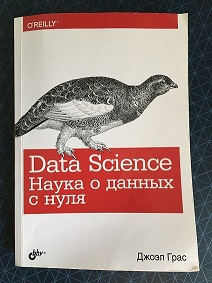

Data Science from Scratch
=========================

This is a fork with executed code of the book _Data Science from Scratch_ written by Joel Grus.
All examples are made as .ipynb files in Jupiter Notebook.

I created executable files while studying this book. All files partially repeat the code from the book, but a part of the code is changed, updated and adapted to Python 3.

I used russian edition of [the first edition of original book](https://www.oreilly.com/library/view/data-science-from/9781491901410/). First edition was originally published in 2015 and there was a second edition in 2019. So part of the code has been significantly updated by me.

## Table of Contents

1. [Introduction](https://github.com/MarkVoitov/data-science-from-scratch/blob/master/ipynb/01_introduction.ipynb)
2. [A Crash Course in Python](https://github.com/MarkVoitov/data-science-from-scratch/blob/master/ipynb/02_crash_course_in_python.ipynb)
3. [Visualizing Data](https://github.com/MarkVoitov/data-science-from-scratch/blob/master/ipynb/03_visualizing_data.ipynb)
4. [Linear Algebra](https://github.com/MarkVoitov/data-science-from-scratch/blob/master/ipynb/04_linear_algebra.ipynb)
5. [Statistics](https://github.com/MarkVoitov/data-science-from-scratch/blob/master/ipynb/05_statistics.ipynb)
6. [Probability](https://github.com/MarkVoitov/data-science-from-scratch/blob/master/ipynb/06_probability.ipynb)
7. [Hypothesis and Inference](https://github.com/MarkVoitov/data-science-from-scratch/blob/master/ipynb/07_hypothesis_and_inference.ipynb)
8. [Gradient Descent](https://github.com/MarkVoitov/data-science-from-scratch/blob/master/ipynb/08_gradient_descent.ipynb)
9. [Getting Data](https://github.com/MarkVoitov/data-science-from-scratch/blob/master/ipynb/09_getting_data.ipynb)
10. [Working With Data](https://github.com/MarkVoitov/data-science-from-scratch/blob/master/ipynb/10_working_with_data.ipynb)
11. [Machine Learning](https://github.com/MarkVoitov/data-science-from-scratch/blob/master/ipynb/11_machine_learning.ipynb)
12. [k-Nearest Neighbors](https://github.com/MarkVoitov/data-science-from-scratch/blob/master/ipynb/12_k_nearest_neighbors.ipynb)
13. [Naive Bayes](https://github.com/MarkVoitov/data-science-from-scratch/blob/master/ipynb/13_naive_bayes.ipynb)
14. [Simple Linear Regression](https://github.com/MarkVoitov/data-science-from-scratch/blob/master/ipynb/14_simple_linear_regression.ipynb)
15. [Multiple Regression](https://github.com/MarkVoitov/data-science-from-scratch/blob/master/ipynb/15_multiple_regression.ipynb)
16. [Logistic Regression](https://github.com/MarkVoitov/data-science-from-scratch/blob/master/ipynb/16_logistic_regression.ipynb)
17. [Decision Trees](https://github.com/MarkVoitov/data-science-from-scratch/blob/master/ipynb/17_decision_trees.ipynb)
18. [Neural Networks](https://github.com/MarkVoitov/data-science-from-scratch/blob/master/ipynb/18_neural_networks.ipynb)
19. [Clustering](https://github.com/MarkVoitov/data-science-from-scratch/blob/master/ipynb/19_clustering.ipynb)
20. [Natural Language Processing](https://github.com/MarkVoitov/data-science-from-scratch/blob/master/ipynb/20_natural_language_processing.ipynb)
21. [Network Analysis](https://github.com/MarkVoitov/data-science-from-scratch/blob/master/ipynb/21_network_analysis.ipynb)
22. [Recommender Systems](https://github.com/MarkVoitov/data-science-from-scratch/blob/master/ipynb/22_recommender_systems.ipynb)
23. [Databases and SQL](https://github.com/MarkVoitov/data-science-from-scratch/blob/master/ipynb/23_databases.ipynb)
24. [MapReduce](https://github.com/MarkVoitov/data-science-from-scratch/blob/master/ipynb/24_mapreduce.ipynb)
25. Go Forth And Do Data Science
